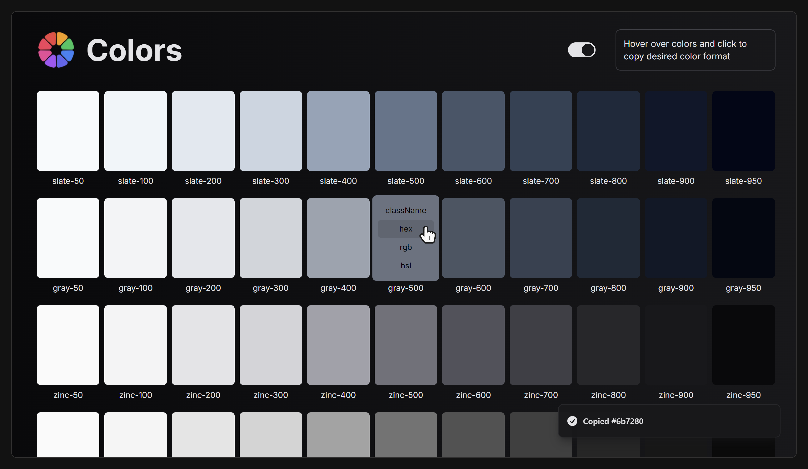

# Colors

A simple web app that provides an easy way to copy and paste Tailwind CSS colors in various formats for quick use in web development projects.

## Features

-   Access all default Tailwind colors conveniently organized in one place
-   Easily copy colors in multiple formats: Tailwind Classname, HEX, RGB, HSL
-   Save time searching for Tailwind colors and manually converting between formats

## Tech Stack

-   **Next.js**: For the frontend of the app
-   **Tailwind CSS**: Used for styling and the colors of course
